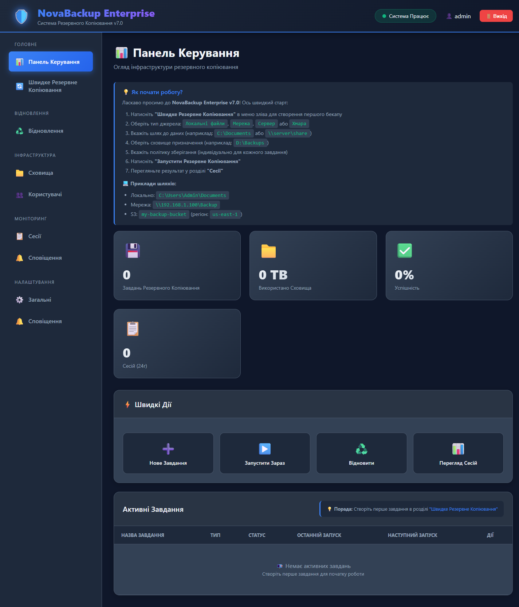
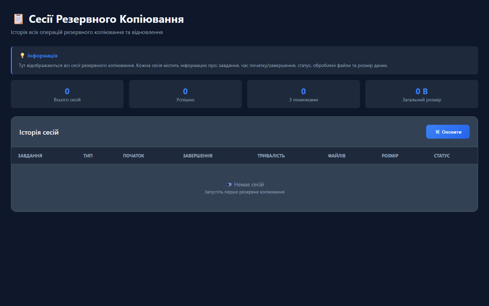
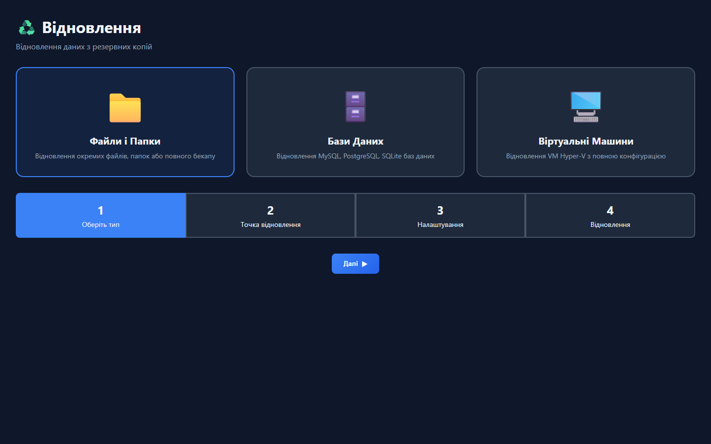

# NovaBackup Enterprise v7.0

Production-ready backup & recovery platform for Windows Server.

[](LICENSE)
[](https://golang.org)
[](https://microsoft.com)
[](https://ukraine.ua)

---

## Highlights
- File/Folder, DB, Hyper-V VM backups
- Incremental + deduplication + compression
- Fast restore: files, DB, VM
- Web UI + RBAC + audit logs

---

## Quick Start

### Windows (PowerShell as Administrator)

**Install**
```powershell
Invoke-WebRequest -Uri "https://raw.githubusercontent.com/ajjs1ajjs/Backup/main/install.bat" -OutFile "install.bat"; .\install.bat
```

**Update**
```powershell
Invoke-WebRequest -Uri "https://raw.githubusercontent.com/ajjs1ajjs/Backup/main/update.bat" -OutFile "update.bat"; .\update.bat
```

### Linux (Ubuntu/Debian)

**Install**
```bash
curl -fsSL https://raw.githubusercontent.com/ajjs1ajjs/Backup/main/install.sh | sudo bash
```

**Update**
```bash
curl -fsSL https://raw.githubusercontent.com/ajjs1ajjs/Backup/main/update.sh | sudo bash
```

**Service**
```bash
sudo systemctl status novabackup
sudo systemctl restart novabackup
```

### Access Web UI
```
URL: http://localhost:8050
Login: admin
Password: admin123
```

Change the default password after first login.

---

## Screenshots

**Dashboard**


**Sessions**


**Restore**


---

## Documentation
- [README.md](README.md)
- [INSTALL.md](INSTALL.md)
- [ENTERPRISE_DEPLOYMENT.md](ENTERPRISE_DEPLOYMENT.md)
- [Releases](https://github.com/ajjs1ajjs/Backup/releases)
- [Wiki](https://github.com/ajjs1ajjs/Backup/wiki)

---

## Build From Source (Git)
```powershell
git clone https://github.com/ajjs1ajjs/Backup.git
cd Backup
go build -o novabackup.exe .\cmd\novabackup
.\novabackup.exe server
```

**Update from Git**
```powershell
git pull
go build -o novabackup.exe .\cmd\novabackup

# If running as a service
.\novabackup.exe stop
.\novabackup.exe start
```

Note: The Web UI is served from the `web/` folder next to `novabackup.exe`.

---

## Technical Details

### Services & Ports
- HTTP: `8050`
- HTTPS: `8443` (if enabled in config)
- Windows service: `NovaBackup`
- Linux systemd service: `novabackup`

### Paths & Data Layout
**Windows (install.bat)**
- EXE: `C:\Program Files\NovaBackup\NovaBackup.exe`
- Web UI: `C:\Program Files\NovaBackup\web\`
- Data: `C:\ProgramData\NovaBackup\`
- Logs: `C:\ProgramData\NovaBackup\Logs\`

**Linux (install.sh)**
- EXE: `/opt/novabackup/NovaBackup`
- Data: `/var/lib/novabackup/`
- Logs: `/var/lib/novabackup/logs/`

**Dev/Portable**
- Data: `<exe_dir>\data\`
- Sessions: `<data>\sessions\*.json`
- DB: `<data>\novabackup.db`

### Backup Layout (File Jobs)
```
<destination>\<job_name>\YYYY-MM-DD_HHMMSS\
  backup.zip
  metadata.json
```

### Sessions & Metadata
- Backup sessions are written to `data/sessions/<session_id>.json`
- Summary is also stored in SQLite (`novabackup.db`) for quick listing

### API Quick Reference
```bash
GET  /api/health
POST /api/auth/login
GET  /api/jobs
POST /api/jobs
POST /api/jobs/:id/run
GET  /api/backup/sessions
GET  /api/backup/sessions/:id/files
POST /api/restore/files
POST /api/restore/database
```

---

## System Requirements
| Component | Minimum | Recommended |
|-----------|---------|-------------|
| OS | Windows Server 2019 | Windows Server 2022 |
| CPU | 2 cores | 4+ cores |
| RAM | 4 GB | 8+ GB |
| Disk | 1 GB + backup storage | SSD for database |
| Network | 1 Gbps | 10 Gbps |

---

## Support
Support portal: https://support.novabackup.local

---

## License
Enterprise License - see [LICENSE](LICENSE)
